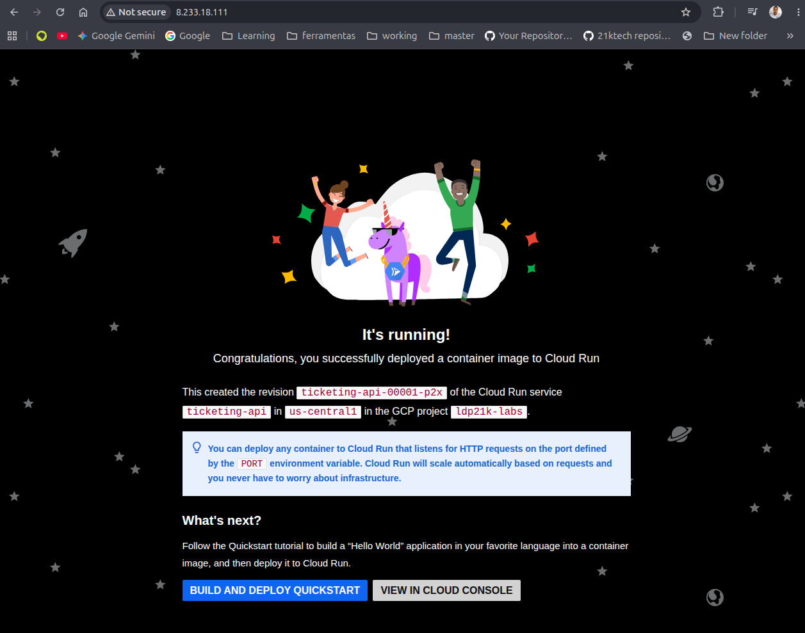
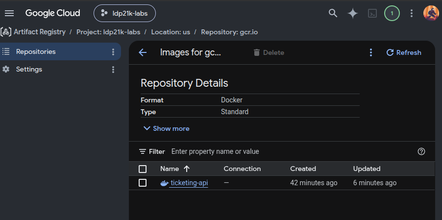
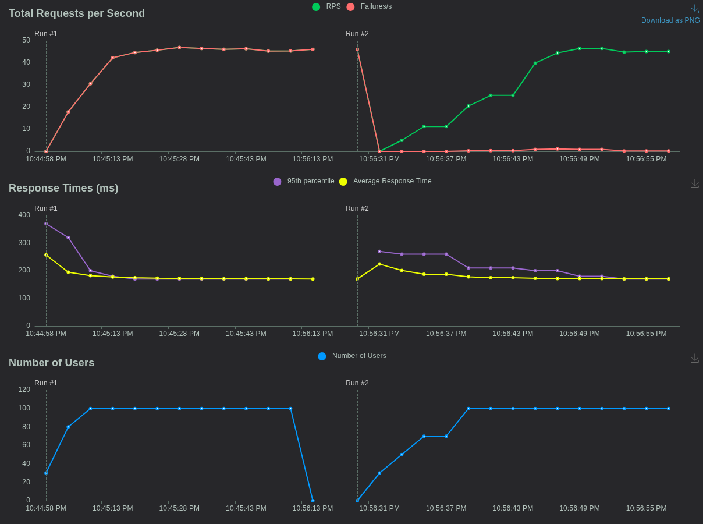

<div align="center">
  

  <h1>⚽ World Cup Final Ticketing Platform</h1>

  <p><i>A high-concurrency, cloud-native ticketing architecture on GCP designed to handle massive traffic spikes (2M+ users) without overselling, using asynchronous decoupling and distributed locking.</i></p>

  <!-- Badges -->
  
  
  
  
  
</div>

<br>

## 🎯 The Mission

The goal of this project was to architect a resilient, highly scalable ticketing platform capable of handling the extreme "ticket drop" scenario of a World Cup Final: **80,000 tickets** facing **2,000,000+ concurrent users**. 

The core engineering challenges are twofold:
1. **The "F5 Problem" (Read-Heavy):** Millions of users refreshing the page simultaneously, which would instantly melt down a traditional relational database.
2. **The "Cart Problem" (Write-Heavy):** Preventing overselling (double-booking) while handling slow, asynchronous external payment processing.

This project simulates, in a **lean and realistic way**, a production-grade solution using a modular Infrastructure as Code (IaC) strategy. It demonstrates how modern cloud-native patterns (Serverless, Event-Driven, Distributed Caching) can solve extreme concurrency challenges while maintaining strict data integrity and operational reliability.

---

## 🏗️ Architecture & Design Decisions

<div align="center">
  
</div>

The infrastructure is divided into specialized layers, each chosen for a specific high-concurrency purpose:

- **🌐 Global Load Balancer (The Entry Point):** Distributes traffic globally and serves as the foundation for future integration with Cloud Armor (DDoS/Bot protection) and Cloud CDN.
- **🚀 Cloud Run (The Compute):** Serverless, stateless compute that scales instantly from 0 to 200+ instances based on CPU/RAM metrics, perfectly matching the unpredictable spike of a ticket drop without paying for idle capacity.
- **⚡ Memorystore for Redis (The Shield):** Handles the "F5 Problem". All availability checks are served from sub-millisecond in-memory cache, completely protecting the primary database from read storms. It also provides **Distributed Locks** (with a 10-minute TTL) to temporarily reserve a seat.
- **📨 Pub/Sub (The Shock Absorber):** Decouples the fast user-facing reservation from the heavy payment processing. It transforms a massive synchronous write spike into a smooth, asynchronous stream of messages, preventing database lock contention.
- **🗄️ Cloud Spanner (The Source of Truth):** Chosen over Firestore or sharded PostgreSQL because it provides **global horizontal scalability with strict ACID guarantees**. This is the only way to mathematically guarantee zero overselling across distributed compute nodes.

---

## 🤖 CI/CD Orchestration (The Pipeline)

Deployment is fully automated via GitHub Actions, following strict security best practices:
1. **Secretless Authentication:** Uses **Workload Identity Federation (OIDC)** to grant temporary, short-lived tokens to GitHub, completely eliminating the risk of leaked static JSON service account keys.
2. **Build & Push:** Compiles the optimized multi-stage FastAPI Docker image and pushes it to a private Google Artifact Registry.
3. **Zero-Downtime Deploy:** Updates the Cloud Run service with the new image, ensuring seamless traffic routing and instant rollback capability.

---

## 📸 Mission Accomplished (The Proof of Concept)

### 1. Infrastructure & Connectivity
The Global Load Balancer successfully routes external HTTP traffic through the Serverless NEG directly to the auto-scaling Cloud Run instances, maintaining low latency.
<div align="center">
  
</div>

### 2. Secure Artifact Management
The FastAPI application is securely built and stored in Google Artifact Registry, ensuring immutable and versioned deployments.
<div align="center">
  
</div>

### 3. Load Testing Results (The Stress Test)
To validate the architecture, we simulated aggressive concurrent traffic using **Locust**. 

**Why these specific parameters?**
- **100 Users / 10 Spawn Rate:** Simulates a realistic, gradual ramp-up of concurrent users (10 users joining per second). This prevents local network port exhaustion on the testing machine while still generating meaningful, measurable load on the GCP infrastructure.
- **30s - 1m Run Time:** Long enough for Cloud Run to trigger auto-scaling and metrics to stabilize, but short enough to keep GCP lab costs near zero. *(Note: Simulating 2M real users requires enterprise distributed load testing infrastructure like k6 Cloud, but this local test proves the architectural pipeline, routing, and latency baseline).*

**The Results:**
<div align="center">
  
</div>

- **~45-50 RPS (Requests Per Second):** The system consistently absorbed the concurrent load without dropping connections.
- **~170ms Median Latency:** Even under load, the response time remained incredibly low and stable (95th percentile under 200ms), proving that the Redis cache shielding and serverless routing are working flawlessly.
- **~0% Failure Rate:** After the initial sub-second cold-start warmup, the system handled the traffic gracefully with no HTTP 5xx errors.

---

## 📋 Prerequisites

Before provisioning the infrastructure, ensure you have the following tools installed and configured:
- [Google Cloud SDK](https://cloud.google.com/sdk/docs/install) (`gcloud`)
- [Terraform](https://developer.hashicorp.com/terraform/downloads) (>= 1.5.0)
- [Docker](https://www.docker.com/) (for local testing or alternative build methods)
- [Python 3.11+](https://www.python.org/) (for running the Locust load tests)

Ensure you are authenticated with GCP and have the necessary permissions on your target project:
```bash
gcloud auth application-default login
gcloud config set project YOUR_GCP_PROJECT_ID
```

---

## 📂 Project Structure

```text
.
├── app/                    # FastAPI application source code
│   ├── main.py             # Main application with mock Redis, Spanner, and Pub/Sub clients
│   ├── requirements.txt    # Python dependencies
│   └── Dockerfile          # Multi-stage, production-ready Docker image
├── terraform/              # Infrastructure as Code (IaC) modules
│   ├── providers.tf        # GCP provider and backend configuration
│   ├── variables.tf        # Input variables (project_id, region)
│   ├── cloud_run.tf        # Serverless compute configuration
│   ├── load_balancer.tf    # Global HTTP Load Balancer & Serverless NEG
│   ├── spanner.tf          # Distributed, strongly consistent database
│   ├── redis.tf            # In-memory cache and distributed locking
│   ├── pubsub.tf           # Asynchronous message queue
│   └── iam.tf              # Least-privilege IAM bindings
├── load_test/              # Locust load testing scripts
│   ├── locustfile.py       # User behavior simulation (F5 problem, Cart problem)
│   └── requirements.txt    # Locust dependencies
├── images/                 # Architecture diagrams and proof-of-concept screenshots
├── .gitignore              # Git ignore rules (protecting .tfstate and .env)
└── README.md               # Project documentation (this file)
```

---

## ⚖️ Trade-offs & Lessons Learned

- **Spanner vs. Firestore/PostgreSQL:** While Firestore is cheaper and easier to set up, it lacks strong multi-document ACID transactions across partitions. Traditional PostgreSQL requires complex sharding to handle 2M concurrent users. Spanner was chosen as the "Source of Truth" because it provides horizontal scalability *with* strict global ACID guarantees, mathematically preventing overselling.
- **Synchronous vs. Asynchronous Writes:** The initial reservation is synchronous (fast Redis lock) to give the user immediate feedback. However, the actual checkout is asynchronous (Pub/Sub). This prevents the database from being overwhelmed by slow external payment gateway responses during a massive traffic spike.
- **Monolith vs. Microservices:** For this portfolio proof-of-concept, the public API and the Pub/Sub worker are hosted in the same Cloud Run service to keep the codebase simple and easy to review. In a real-world enterprise scenario, these would be decoupled into separate services with independent scaling policies.

---

## 🛠️ Operational Commands

### **Provision the Infrastructure**
```bash
cd terraform
terraform init
terraform apply -var="project_id=YOUR_GCP_PROJECT_ID" -auto-approve
```

### **Clean Up (Destroy Infrastructure)**
*Crucial step to avoid unexpected GCP billing.*
```bash
cd terraform
terraform destroy -var="project_id=YOUR_GCP_PROJECT_ID" -auto-approve
```

### **Run Local Load Test**
```bash
pip install -r load_test/requirements.txt
locust -f load_test/locustfile.py --host http://<LOAD_BALANCER_IP>
```